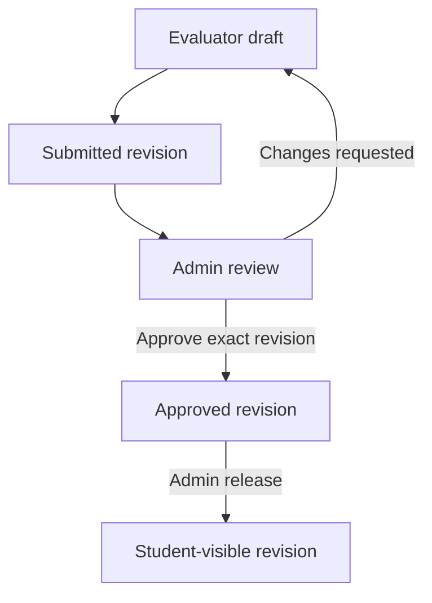

# ElevateMe — Temporary Evaluator Access and Admin Report Approval

## Overview

ElevateMe will provide **one shared evaluator/coordinator workspace**, accessible only through individually issued, single-use invitation links. Evaluators will not need permanent accounts or passwords. Each invitation identifies a specific evaluator and grants access only to assigned students in a particular session.

**Admin accounts remain separate.** The earlier reference to “one admin account” was a typo for the evaluator account/workspace. This change does not reduce the number of admin accounts or give evaluators admin access. The shared evaluator experience must still preserve a distinct identity for each evaluator's work.

An admin generates a link that expires **24 hours after creation**. The evaluator activates it once and continues using the same browser session until that fixed deadline. Submission sends reports to an admin review queue. Only admins can approve and distribute reports to students.

Admins see an internal evaluator-details section on every submitted report. Students receive the approved scores and feedback without evaluator identity, contact details, invitation information or internal review notes. The separation is enforced by the backend, including exports and notifications, rather than merely hidden in the interface.

### Agreed operating model

| Area | Required behavior |
| --- | --- |
| Evaluator access | One workspace; a distinct invitation and restricted session per evaluator |
| Permanent evaluator login | None in the new workflow |
| Invitation issuer | Approved DI admins only |
| Link usage | One successful activation; never reusable to create another session |
| Access deadline | Invitation creation time + 24 hours; activation does not extend it |
| Assignment scope | Explicit session and student assignments; empty scope grants no access |
| Evaluation | Draft, save, submit to DI; no approval or release permissions |
| Admin workflow | Review exact revision, approve or request changes, then release |
| Student visibility | Only released, approved revisions |
| Evaluator details | Internal admin report view only; evaluator can confirm their own invitation details |
| Expired access | Saved work remains; admin can issue a replacement invitation |

### Scope and evidence

- Repository: <https://github.com/appelevateme-alt/elevateme>
- Reviewed baseline: `711ddda90a856160a7c193d9c11329597f310e64` on 4 October 2026.
- Stack: React/TypeScript, Java/Spring Boot, Supabase, Vercel frontend and separate Java hosting.
- This is a targeted implementation plan based on source inspection, not a claim that the deployed application was tested.
- Implement against the current branch. Verify which findings remain before editing.
- Preserve scoring, deterministic insights, recommendations and other unrelated functionality.

## 1. Architecture and account model

Reuse the existing guest invitation and evaluation system. Do not create one shared Supabase Auth user whose name/email is overwritten for each evaluator. That would lose attribution and make unrelated sessions share a login identity.

“One evaluator account” is represented in the product as a single evaluator workspace and permission set. In the backend, each request has a principal containing the invitation ID, guest session ID, evaluator identity ID and allowed assignments. These are temporary access records, not permanent evaluator login accounts.

Admins continue authenticating normally. Their role and account status must be verified server-side. Legacy coordinator/evaluator password logins must not remain an alternative route into this workspace after cutover. Preserve historical profile records needed for old reports; disable obsolete access rather than deleting history.

Program creation, roster administration and invitation management move to the admin workspace where the retiring coordinator workflow previously owned them. Evaluators receive only the evaluation functions required for their assignment.

### Permission matrix

| Action | Active invited evaluator | Approved admin | Student/shared parent account |
| --- | --- | --- | --- |
| Create/revoke/replace invitations | No | Yes | No |
| Confirm own invitation details | Yes | Yes | No |
| See assigned roster | Assigned students only | Authorized administrative scope | No |
| Save/submit assigned drafts | Yes, before expiry/revocation | Administrative access must be audited | No |
| See submitted evaluator details | Own invitation identity only | Yes | No |
| Request changes or approve | No | Yes | No |
| Release reports | No | Yes | No |
| Read student reports | Own submission read-only during valid access | Yes | Own released reports only |
| Read student history/contact details | No | Existing authorized access | Own information only |

Reject requests outside scope even when the caller guesses a valid evaluation or student ID. Apply the same restrictions to all old and new routes.

## 2. Current repository gaps and change locations

| File/area | Observed baseline | Planned change |
| --- | --- | --- |
| `backend/.../participation/GuestService.java` | Exchange validates a link then creates a session; no consumption step | Atomic single redemption; fixed expiry; admin-only issuance/revocation |
| `backend/.../participation/GuestRepository.java` | Invitation expiry inherited from database trigger; session gets separate 24-hour default | Explicit deadlines, consumed state and one session per invitation |
| `database/migrations/V3__evaluation.sql` and `V8__evaluation_phase3.sql` | Existing expiry defaults include session end + 7 days / 30 days | New forward migration replacing future defaults and upgrading constraints |
| `GuestService.checkGuestStudent` | Empty allow-list permits session-wide access | Empty means no access; explicit assignment snapshot required |
| `backend/.../evaluation/EvaluationService.java` | Guest submission audit exists; guest revisions use a null profile author | Typed evaluator/invitation attribution on revisions |
| `backend/.../performance/ReleaseService.java` | Release requires active staff, with guests denied | Approved admin only; exact revision approval required |
| `backend/.../performance/PerformanceRepository.java` | Student report payload includes evaluator ID/name | Separate allow-listed student projection |
| `frontend/src/pages/app/ReportDetailPage.tsx` | Displays evaluator name | Remove attribution; use student-safe response type |
| `frontend/src/pages/evaluate/GuestInvitePage.tsx` | Automatically exchanges invitation on mount | Explicit activation screen and expiry-aware session restoration |
| Admin pages and roster | Existing program/roster flows | Invitation management, review queue, release preview |

Paths abbreviated with `backend/.../` are under `backend/src/main/java/com/elevateme/`.

The repository also contains a legacy root `src/` application. Recent commits modify that app even though README identifies `frontend/` as the revamp. Before implementation, confirm the actual Vercel root and API/data paths. Do not complete this only in an inactive frontend. Any still-accessible legacy Supabase RPCs or direct data routes must enforce equivalent permissions and report privacy, or be retired during cutover.

## 3. Invitation creation and evaluator details

Add **Invite evaluator** to the admin session roster. Collect:

- Required: evaluator full name and email.
- Optional: organisation and professional role/title.
- Required: session and explicit student selection.

The backend validates selected students belong to the session, checks existing assignment conflicts and snapshots the selection. A “Select all current students” action must create explicit assignments; it must not silently include students registered later. Retain the existing single active evaluator assignment per student/session rule unless an admin explicitly reassigns it.

Create a 256-bit or stronger random token with a cryptographically secure generator. Store only a SHA-256 token hash. Return the full invitation URL once to the creating admin, with `expiresAt`. Do not log the raw token or capture it in analytics/error telemetry.

Recommended URL: `/evaluate/invite#t=<opaque-token>`.

Resolve session scope on the server; URL parameters do not grant access. Display the exact deadline in Asia/Colombo time with a timezone label. Store timestamps as timezone-aware UTC instants.

The MVP uses a **Copy invitation link** action, matching the admin-provided-link workflow. If automated email delivery is added later, design secure transient delivery separately; do not quietly put raw tokens into ordinary plaintext audit/outbox payloads.

## 4. Exact lifetime and redemption semantics

### 4.1 Absolute deadline

Set `expires_at = created_at + interval '24 hours'` using the database clock. The guest session's `expires_at` must be the same deadline. No sliding extension, refresh token or browser activity may extend it.

Example: created Monday 10:00 AM, activated Monday 2:00 PM, expires Tuesday 10:00 AM. The evaluator receives 20 hours of remaining access. At `now >= expires_at`, reads and writes fail.

Expiry closes access; it never deletes drafts, submitted reports, review decisions or historical attribution. Admin review and release remain available after invitation expiry.

### 4.2 Activation screen

Opening a URL must not consume the token through a GET request or automatic component effect. Show a short explanation and **Start evaluation** button. Submit the token only when the evaluator activates. Prevent duplicate activation requests from double clicks and React effect remounts.

Capture the token in memory and remove it from the visible URL promptly. Do not store it in localStorage or sessionStorage. Before redemption, avoid displaying evaluator/student details; after redemption show the identity-confirmation screen. Use a no-referrer policy and no third-party analytics on the invitation page.

### 4.3 Atomic exchange

Use one database transaction to claim the invitation and insert the guest session:

```sql
UPDATE app.guest_invitations
SET consumed_at = now()
WHERE token_hash = :token_hash
  AND consumed_at IS NULL
  AND revoked_at IS NULL
  AND expires_at > now()
RETURNING id, evaluator_identity_id, expires_at;
```

Zero returned rows means no new session. Exactly one successful claimant can insert the session. Add a unique constraint on `guest_sessions.invitation_id` for the new invitation model as a second safeguard. Generate a separate random session token and persist only its hash.

If session insertion fails, the transaction rolls back consumption. If the transaction commits but the browser never receives the cookie, do not permit a second anonymous redemption; the admin can issue a replacement invitation. If a browser already has the matching valid session, route it back to the workspace without redeeming again.

### 4.4 Session enforcement

Use a Secure, HttpOnly, host-only cookie with an appropriate SameSite policy through the same-origin frontend API proxy. Cookie lifetime must be no longer than the remaining invitation lifetime. Clear it on expiry/logout. Server-side expiry is authoritative even if a cookie remains in the browser.

Every guest request validates session hash, invitation expiry/revocation and assignment scope. Consumption blocks new exchanges, not the already-created session. Reject missing or invalid deadline values rather than treating them as unlimited access.

Use explicit CSRF protection for cookie-authenticated mutations, configured trusted frontend origins and rate limiting on activation. Do not rely on untrusted forwarded headers to construct the expected origin. Keep guest access independent of any unrelated admin/student Bearer session present in the browser.

Recheck access at mutation time within the transaction so a revoked or expired session cannot save or submit based solely on an earlier page load. Define consistent lock ordering for invitation/assignment/evaluation operations to avoid deadlocks.

## 5. Replacement links, revocation and assignment changes

Admin invitation management shows evaluator, session, assigned student count, created/expiry times and status: Pending activation, Active, Expired or Revoked. Consumption is a separate fact from expiry/revocation; derive display status consistently.

Provide **Revoke access** and **Issue replacement link**.

Replacement must revoke the old invitation and its session, create a fresh 24-hour invitation and preserve the same evaluator identity, assignment and saved drafts. Record `replaces_invitation_id` and the issuing admin. A new deadline is an explicit admin action, never an automatic extension.

Different evaluators may use the shared workspace concurrently under separate invitations. There is no global shared cookie or mutable shared name. For a deliberate reassignment to a different evaluator, revoke previous access to those assignments and preserve prior author snapshots. Require an admin-confirmed handoff rather than silently attributing someone else's draft to the replacement evaluator.

A lost cookie, switched device or cleared browser storage requires a replacement invitation. The original link cannot create a second session. Ordinary refresh/reopening in the same browser continues while the cookie and invitation remain valid.

## 6. Data model and migrations

Adapt naming to existing conventions, but preserve these concepts:

| Record | Required additions/purpose |
| --- | --- |
| `evaluator_identities` | Stable ID, name, email, optional organisation/title, created_by/at; not a Supabase Auth login |
| `guest_invitations` | evaluator_identity_id, consumed_at, required expires_at, revoked_at, replaces_invitation_id; existing token_hash and issuer retained |
| `guest_sessions` | Unique invitation reference for new invitations; required absolute expiry; hashed session token |
| Invitation assignments | Explicit student/session/evaluation mapping; no empty-list wildcard |
| `evaluation_revisions` | submitted_by_evaluator_id, submitted_via_invitation_id, submitted_at and evaluator identity snapshot |
| `evaluation_reviews` | revision_id, decision, admin_id, timestamp, internal notes and evaluator-facing change request |
| Release records | Exact approved revision IDs and releasing admin/time; retain idempotency lineage |

Use explicit author types or separate nullable foreign keys for admin-authored versus invited-evaluator revisions. Do not coerce an invitation ID into an existing profile foreign key or impersonate a shared profile. Keep evaluator identity snapshot fields internal by construction.

Approval records are append-only. Enforce at most one effective approval for a particular revision and preserve superseded decisions. Distinguish internal review notes, evaluator-visible change requests and student-facing feedback in storage and response types.

Add a new forward Flyway migration; do not rewrite migrations already applied to environments. Follow the repository's canonical migration and resource-copy process. Before enforcing uniqueness, handle old invitations with multiple sessions: revoke legacy access during cutover and reissue as necessary. Do not invent missing historical evaluator identities; mark them as legacy/unavailable internally. Existing historical reports must remain readable without requiring backfilled approvals that never occurred.

Protect internal identity/review tables from student Supabase Data API access. If direct legacy access remains enabled, apply equivalent RLS/privileges and response projection protections there as well.

## 7. Evaluation submission and admin review

Keep the ten-criterion rubric and existing scoring unchanged. Retain draft autosave, optimistic version checks and Next student navigation.

### Revision lifecycle



Submission atomically validates all scores, writes an immutable submitted revision with evaluator snapshot and timestamp, locks that submission, and queues an admin notification. Use **Submit to DI for review**. Display **Submitted — awaiting DI review** after success. Submitting one student does not prevent completing other assigned students.

The admin review queue offers filters by session, evaluator and review status. Each report shows scores/feedback, an internal evaluator panel and revision history. Actions are **Approve**, **Request changes**, and **Preview student report**.

Approval must target a supplied revision ID/version and reject stale review screens with a conflict response. Request changes creates or reopens a working draft while preserving the prior submitted revision and decision. A new submission is a new revision and needs fresh approval.

Never overwrite an already released revision while making corrections. Retain a separate released-revision pointer so students continue seeing the old approved version until the corrected revision is approved and released. Existing `LOCKED` behavior must be adapted carefully so pending corrections do not disappear from student history or become visible prematurely.

Admin edits, if retained, must create an attributed revision with a reason. The original evaluator identity cannot imply authorship of changes made by an admin.

## 8. Admin-only report distribution

Replace staff-level release authorization with approved-admin authorization everywhere, including alternate controllers/RPCs. Evaluators must not be able to approve, reopen themselves, release or publish through direct API calls.

For session-wide distribution, preserve the existing completeness rule: all expected non-excluded students must have a current approved report. Absent/excluded students do not become zero-score reports. Include approved-versus-required counts and unresolved items in preview.

Release transaction:

1. Verify admin and request idempotency key.
2. Lock the relevant session/assignment and report rows in a consistent order.
3. Recompute readiness and validate approval of the exact revision set.
4. Record the release and update student-visible revision pointers.
5. Insert deduplicated student in-app/email outbox events.
6. Commit all changes together.

Do not release whatever happens to be the latest revision after approving an earlier revision. If it changed, stop and require review. Repeated/concurrent requests must not duplicate notifications or released versions. Failed transactions must not partially publish reports. Students' graphs, insights and personal bests update only from released revisions.

## 9. Admin and student report separation

Use distinct backend DTOs/projections, not one generic map sent to everyone. Student payloads should be built from an allow-list, not by deleting a few known sensitive fields.

| Admin-only review content | Student-visible report content |
| --- | --- |
| Evaluator name, email, organisation, role/title | Student and program/session details |
| Evaluator identity and invitation references | Ten approved scores and scaled total |
| Evaluator submission timestamp | Approved student-facing feedback |
| Internal review notes and decision history | Release date and published version |
| Internal correction/handoff reasons | Deliberately authored student-facing correction note, if applicable |

The evaluator may see their own identity confirmation and change requests, but not private admin notes or other evaluators' records.

Student report list/detail APIs, print/PDF/export paths, notification text and any download metadata must all use the student-safe projection. PDFs must be generated from the appropriate projection, not from an admin page with a hidden section. Protect admin exports with admin authorization and private caching rules.

Use separate internal and student-facing text inputs. Structured field exclusion cannot prevent a person manually typing an email/name into free-text feedback; show the student preview to the approving admin and make that check part of review. Do not automatically copy internal notes into published feedback.

## 10. API contracts

Reuse existing routes where possible; these are proposed contracts rather than a requirement to duplicate endpoints.

| Operation | Suggested route | Access and behavior |
| --- | --- | --- |
| Issue invitation | `POST /api/v1/sessions/{id}/invitations` | Admin; identity + student selection; returns one-time URL and expiry |
| List invitations | `GET /api/v1/admin/evaluator-invitations` | Admin; metadata only, never raw tokens |
| Revoke | `POST /api/v1/invitations/{id}/revoke` | Admin; immediately blocks linked session |
| Replace | `POST /api/v1/invitations/{id}/replace` | Admin; fresh invitation, old access revoked |
| Activate | `POST /api/v1/guest/exchange` | Token-authenticated exchange; sets cookie |
| Session info | `GET /api/v1/guest/session` | Valid guest; own identity, scope, deadline |
| Roster/draft/submit | Existing guest endpoints | Valid guest plus explicit assignment and version checks |
| Review queue/detail | `GET /api/v1/admin/evaluation-reviews[/{id}]` | Admin-only internal projection |
| Approve revision | `POST /api/v1/admin/evaluations/{id}/approve` | Admin; exact revision ID/version |
| Request changes | `POST /api/v1/admin/evaluations/{id}/request-changes` | Admin; reason and exact revision |
| Student preview | `GET /api/v1/admin/evaluations/{id}/student-preview` | Admin; same projection used for publication |
| Release | Existing session release endpoint | Admin; approved revision set only |
| Student reports | Existing `/api/v1/me/reports` endpoints | Owner-scoped, released, sanitized |

Return structured errors for invalid/used invitation, expired/revoked session, assignment denial, stale revision and release not ready. Avoid disclosing identities or roster data in unauthenticated errors. Map errors to useful plain-language UI messages. No successful toast unless the backend confirms persistence.

## 11. Frontend screens and behavior

### Admin

- Session roster: Invite evaluator, assignment selection and invitation status.
- Invitation list: evaluator, session, deadline, activation state, revoke/replace.
- Review queue: submitted reports, evaluator filter, pending/changes-requested/approved status.
- Review detail: internal evaluator panel, scores, student feedback, separate internal notes, approve/request changes.
- Student preview: exactly the published content, without the internal panel.
- Release preview: approved/required counts and blocking items; explicit confirmation.

### Evaluator

- Activation screen: brief explanation and Start evaluation.
- Identity confirmation: “You are evaluating as [name] for [session].” Wrong details lead to admin assistance, not silent identity switching.
- Roster: assigned students and draft/submitted/changes-requested status.
- Sheet: scores, feedback, save indicator, Next student, Submit to DI for review.
- Visible deadline with a calm warning near expiry; use server-provided remaining time.
- On expiry/revocation: stop protected requests, retain already saved server drafts, clear private rendered content and explain that DI can provide a replacement link. Do not claim unsaved edits were saved.

Use the existing flat, minimal visual style. Do not add a new chat, public evaluator directory, permanent evaluator signup or complex permissions editor.

## 12. Notifications and audit

Queue admin notifications when an evaluation revision is submitted. Queue an evaluator changes-requested notification to the invitation's intended email where configured; do not include student scores or sensitive report contents in email. Student report notifications occur only after release.

Keep database writes and outbox insertion transactional. Use stable deduplication keys per submission/review/release revision and recipient. Provider failures stay visible in the outbox and do not change report approval state. Tests use a mail sink or synthetic recipients.

Record invitation creation/consumption/revocation/replacement, assignment changes, submission, review decision and release. Store actor type/ID, target IDs, timestamps and request ID. Never log raw invitation/session tokens. Preserve detailed identities in authorized records rather than spreading personal data through logs.

## 13. Implementation sequence and exit gates

### Phase A — Verify active application and prepare migration

Inspect current HEAD, deployment roots, Java endpoints, legacy RPCs and schema. Establish the authoritative app. Add the forward migration, typed principal and revision attribution model. Inventory old evaluator logins and invitations for cutover.

**Exit:** clean and upgrade database migrations pass; historical released reports remain available; no invented historical attribution.

### Phase B — Implement invitation lifetime and assignment enforcement

Implement admin-only creation, atomic consumption/session creation, fixed expiry, fail-closed assignments, revocation, replacement and CSRF protection. Update activation/session restoration UI and remove automatic exchange-on-mount.

**Exit:** concurrent redemption has one winner; expiry/revocation blocks reads and writes; replacement preserves saved work.

### Phase C — Implement revision attribution and admin review

Snapshot evaluator details on submission, preserve revisions, add review decisions and queue/detail UI. Make approvals revision-specific and support changes requested with replacement access if needed.

**Exit:** admins can trace every new submission; editing/resubmitting invalidates prior approval for publication; old revisions remain intact.

### Phase D — Enforce publication and student privacy

Require admin for release, validate approved revision sets, update student projections and all exports/notifications, and add the student preview.

**Exit:** unapproved reports cannot be released and evaluator details never appear in student response bodies or artifacts.

### Phase E — Cutover and end-to-end verification

Disable obsolete evaluator/coordinator login routes and privileges, revoke legacy invitations as planned, confirm the deployed frontend/API configuration and document recovery procedures. Verify with synthetic data before production rollout.

**Exit:** complete the acceptance journey below through the active application, with actual persisted records and isolated email delivery.

## 14. Acceptance tests

| ID | Scenario | Expected result |
| --- | --- | --- |
| A01 | Non-admin issues/revokes/replaces link | Backend denies |
| A02 | First valid activation | One guest session; invitation consumed |
| A03 | Two simultaneous activations | Exactly one succeeds; no second session |
| A04 | Activation transaction fails | Consumption rolls back; no orphan session |
| A05 | Same browser refreshes | Continues via existing valid cookie |
| A06 | Second browser reuses consumed link | Cannot create a session |
| A07 | Activate at hour 23 | Access ends at hour 24 from creation |
| A08 | Request at/after exact deadline | Read/write denied server-side |
| A09 | Admin revokes during evaluation | Subsequent mutation rejected; drafts retained |
| A10 | Empty or unrelated assignments | No student access; no session-wide fallback |
| A11 | Two different evaluators work concurrently | Data and attribution remain isolated |
| A12 | Replacement link issued | Old access revoked; same evaluator resumes saved draft |
| A13 | Submit valid report | Immutable attributed revision; admin notified; student sees nothing new |
| A14 | Evaluator attempts approve/release API | Denied regardless of hidden UI controls |
| A15 | Admin requests changes after expiry | Report preserved; replacement access permits a new revision |
| A16 | Admin approves stale revision | Conflict; later content is not implicitly approved |
| A17 | Session contains unapproved/missing reports | Release blocked with actionable counts |
| A18 | Complete approved session released twice/concurrently | One publication effect per revision; no duplicate notifications |
| A19 | Database/outbox insert fails during release | No partial visibility or orphan notification |
| A20 | Student inspects JSON/PDF/email | No evaluator identity, invitation IDs or internal notes |
| A21 | Evaluator profile changes after submission | Historical snapshot remains unchanged |
| A22 | Correction drafted after release | Previous published revision stays visible until approved replacement release |
| A23 | Legacy route or direct Supabase access attempted | Cannot bypass new authorization/privacy rules |
| A24 | Browser and keyboard/mobile use | Usable activation, sheet, review and expiry states |

Use Java integration tests with PostgreSQL for transaction races, expiry, constraints, release atomicity and scope isolation. Inject a controllable clock where applicable and exercise real SQL timestamp boundaries. Add browser tests for activation, saved drafts, review and student projection. Helper-only tests are insufficient for these gates.

### Final demonstration

Admin creates invitation → evaluator activates → confirms identity → saves evaluation → submits to DI → admin sees evaluator details → admin approves the exact revision → admin previews student report → admin releases → student receives notification and sees scores/feedback without evaluator details.

Repeat with expired access, a replacement link and a changes-requested revision. Confirm neither expiration nor replacement loses saved work or historical attribution.

## 15. Delivery checklist for the building agent

- [ ] Identify current deployed app/root and current source commit.
- [ ] Implement new behavior without restarting or broadly redesigning the app.
- [ ] Add forward migrations and document legacy invitation/login cutover.
- [ ] Supply working admin invitation, review and distribution screens.
- [ ] Enforce token consumption, fixed expiry, assignment scope and admin permissions server-side.
- [ ] Separate admin/evaluator/student response models and export paths.
- [ ] Preserve report revision history and historical attribution.
- [ ] Run relevant frontend build, backend tests and acceptance journeys.
- [ ] Provide test results, screenshots using synthetic data and remaining deployment inputs.
- [ ] Do not claim production readiness from compilation alone.

## References

- [Reviewed repository baseline](https://github.com/appelevateme-alt/elevateme/tree/711ddda90a856160a7c193d9c11329597f310e64)
- [OWASP temporary-token guidance](https://cheatsheetseries.owasp.org/cheatsheets/Forgot_Password_Cheat_Sheet.html) — token randomness, secure storage, expiry and single-use properties; applied here to invitation tokens.
- [OWASP session management guidance](https://cheatsheetseries.owasp.org/cheatsheets/Session_Management_Cheat_Sheet.html)

This plan supersedes earlier requirements allowing coordinators/staff to release reports or exposing evaluator attribution to students. Admin authentication, the ten-criterion scoring model and unrelated product features remain in place.
